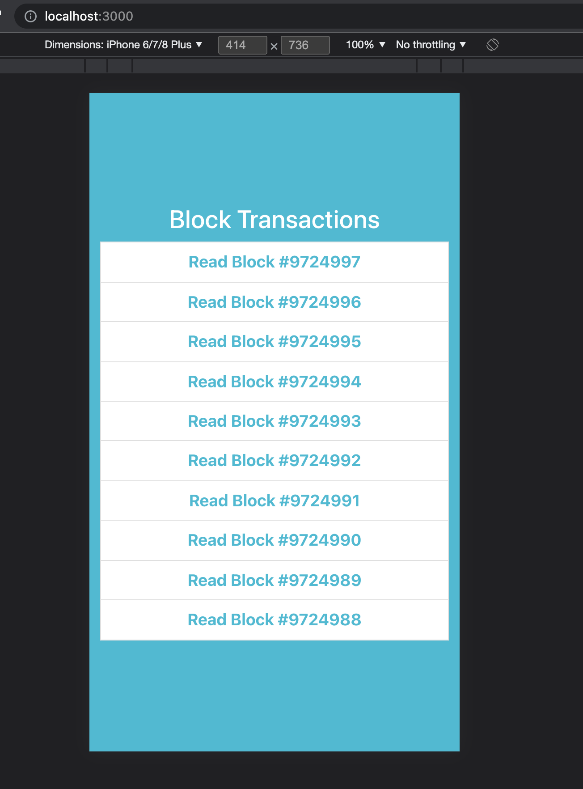
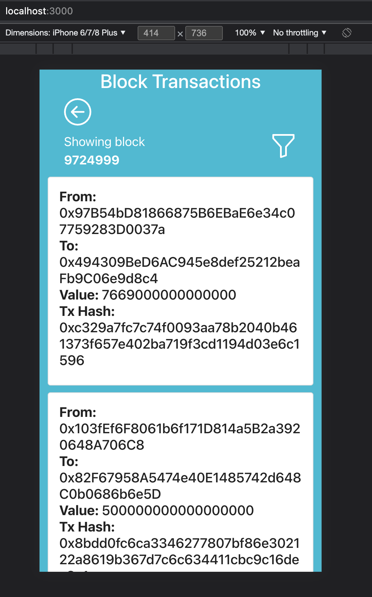
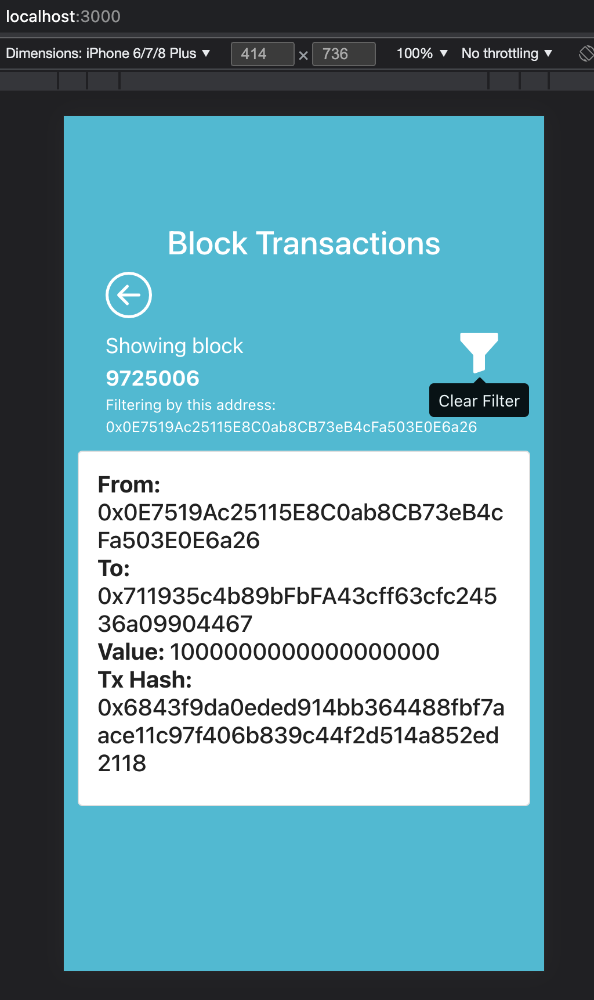
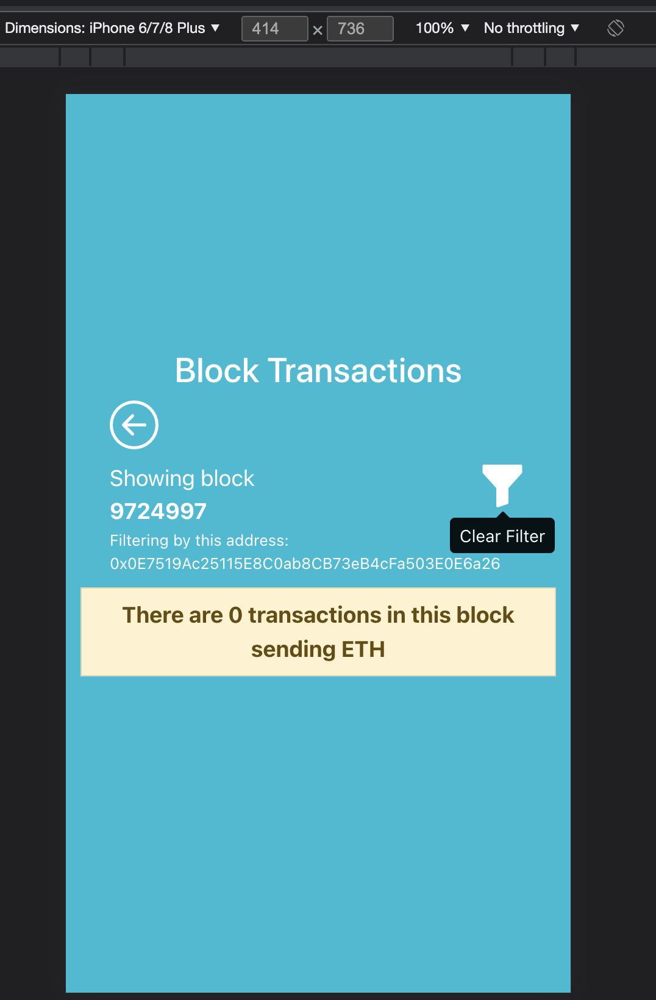

# Block Transactions

This a web application to read information about the latest 10 blocks in the Ethereum blockchain, in specific it shows all the transactions sending ETH. It can be used on mainnet and testnets, the application gets the network provider from the Metamask extension.

This is really useful to validate if your transaction was included in a block or not, also it shows in a filtered way only the transactions that send some ETH.
Currently the most popular method of viewing this information is via etherscam, but this web application offers another option for this.
## How to setup the project
1. Create a configure the Metamask extension.
2. Login to Metamask to have the extension ready.
3. Clone this repository.
4. Run `npm install` inside the root folder of the project.
5. Run `npm start` to start the server. The application interface will open in: http://localhost:3000 . If you have that port running something else, please stop that process and try again.
6. A notification will appear asking for permission, select your account, the network you want to use.
## How to use it

- The first screen shows the list of the last 10 blocks. You can click on one of the blocks to see the information it contains.
- The second screen shows the list of transactions inside the selected block where two addresses exchanged ETH.
- There is a funnel icon that allows you to filter by the current address used in metamask. This will show only the transactions where the current address is in the `from` or `to` values of the transaction. It will show the current address in use for filtering.

## Demo in video

Check out this demo video to get more familiar with the user interface:
<https://youtu.be/tJqqhSfVC-I>

### Refresh period
The application continuously pulls information every 5 seconds to get the latest 10 blocks, but this refresh period can be modified with the environment variable: `REACT_APP_REFRESH_PERIOD`.

### Amount of blocks
The default amount of blocks to pull is 10 but it can be changed.

### Initial block list view:

### Transactions list view:

### Transactions list view using filter:

### Transactions empty:

